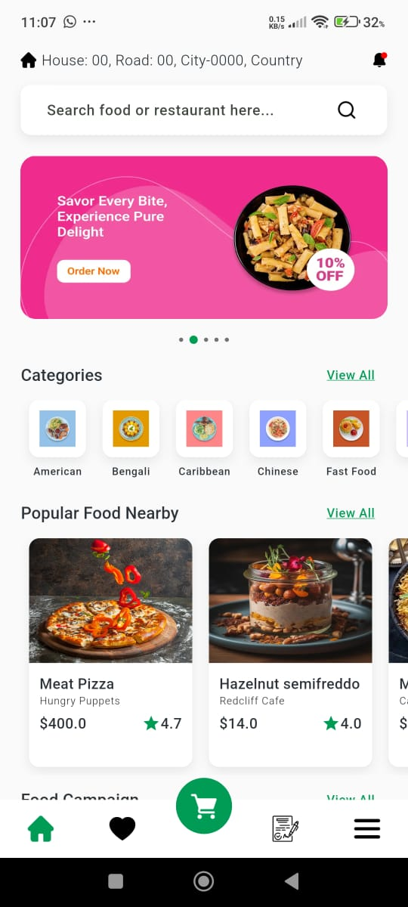
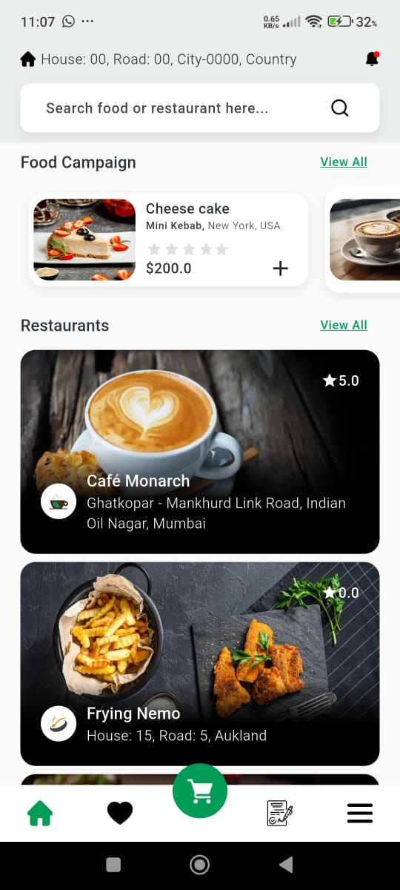

# Food Restaurant App

A Flutter mobile application for browsing restaurants, food items, and campaigns, with smooth UI, dynamic banners, and infinite scrolling pagination for restaurant listings.

---

## Table of Contents

- [Features](#features)
- [Screenshots](#screenshots)
- [Video](#video)
- [Installation](#installation)
- [Folder Structure](#folder-structure)
- [State Management](#state-management)
- [Dependencies](#dependencies)
- [API Integration](#api-integration)
- [Pagination](#pagination)
- [Contributing](#contributing)
- [License](#license)

---

## Features

- Home screen with dynamic banners, categories, popular food items, and restaurant listings
- Smooth carousel slider for banners
- Horizontal scrollable lists for categories, popular foods, and campaigns
- Infinite scroll pagination for restaurants
- Detailed restaurant and food item cards with images, ratings, and price
- Custom network image widget for efficient image loading
- Loading shimmer for smooth user experience while fetching data
- All the senstive urls and string are stored in .env file

---

## Screenshots

<p align="center">
  
  
  
</p>

---

## Video
[Click to watch the video](assets/videos/project_video.mp4)

## Installation

1. Clone the repository:

```bash
git clone https://github.com/EngrMonyrul/Food_Delivery.git
cd Food_Delivery
```

2. Requirement componenets
- Flutter 3.35.5 version
- JDK 23
- Android Studio Narwhal 4

## Folder Structure
```text
lib/
├── core/                       # App-level core utilities and configuration
│   ├── network/                # API clients, network interceptors
│   ├── routes/                 # App navigation and routing
│   └── themeConfig/            # Theme, colors, and UI configurations
│
├── data/                       # Data layer
│   ├── datasources/            
│   │   ├── local/              # Local database, cache, shared preferences
│   │   └── remote/             # Remote API calls
│   ├── models/                 # Data models (DTOs)
│   └── repositories/           
│       └── repo_impl/          # Concrete implementations of repositories
│
├── domain/                     # Domain layer
│   └── repositories/           
│       └── repo/               # Abstract repository interfaces
│
├── presentation/                # UI layer
│   └── view/                    
│       ├── bloc/               # BLoC files (events, states, bloc logic)
│       ├── pages/              # Screens/pages of the app
│       │   └── widgets/        # Reusable widgets for pages
│
└── utils/                       # Helper utilities
├── assets/                 # Images, fonts, icons, etc.
├── extensions/             # Dart extensions for cleaner code
└── services/               # App-level services (location, notifications, etc.)
```

Notes:
- Clean architecture: separates presentation, domain, and data layers
- Scalable: easy to add new features without breaking existing code
- Testable: domain and data layers are isolated for unit testing
- Readable: folders are self-explanatory and organized

## State Management

BLoC (Business Logic Component)
- The app uses flutter_bloc to manage the state.
- HomeBloc handles all home-related data including banners, categories, popular foods, campaigns, and restaurants.
- Pagination is implemented via LoadRestaurantMoreData event.

## Pagination
- Restaurant list supports infinite scroll using ScrollController
- When the user scrolls near the bottom, a LoadRestaurantMoreData event is triggered
- New data is appended to the existing list and the UI updates automatically